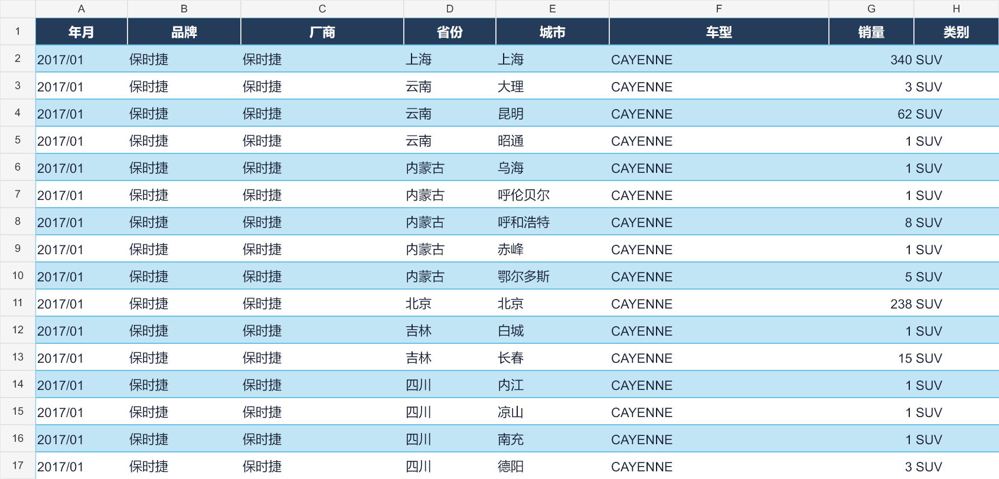

# 2026-10-09 公开文件 / Public files

| 文件 | 下载 | 内容 |
|---|---|---|
| Excel | [NH-汽车销量-20261009.xlsx](data/NH-汽车销量-20261009.xlsx) | 97,241 行、14 列，带筛选和冻结标题 |
| CSV | [NH-汽车销量-20261009.csv](data/NH-汽车销量-20261009.csv) | UTF-8 BOM，与 Excel 同一快照 |
| 数据局部截图 | [汽车销量-局部截图.png](images/汽车销量-局部截图.png) | 从导出的 Excel 渲染，不是微信原始截图 |
| 电脑三模式包 | [NH-Unified-All-Modes-Public-20261009.zip](packages/NH-Unified-All-Modes-Public-20261009.zip) | 纯 GUI、GUI/API、纯 API，Python/OCR 环境、SQLite、SQL 导出、任务断点 |
| 荣耀手机代码 | [NH-Honor-Phone-Code-Public-20261009.zip](packages/NH-Honor-Phone-Code-Public-20261009.zip) | 手机真实截屏→电脑 OCR，桥接和受限执行器源码；需另配运行环境和设备校准 |



## 电脑使用

完整解压电脑 ZIP，不要在压缩软件里执行 CMD。先 `00-Set-Root.cmd` 选择空安装目录（C/D/E 盘均可），再 `01-Install.cmd`，然后 `02-Check-Install-Environment.cmd`。环境检查可按原流程安装缺失的 Microsoft VC++ x64 运行库。

三种入口分别为 `10-Start-Pure-GUI.cmd`、`11-Start-GUI-API.cmd`、`12-Start-Pure-API.cmd`。纯 GUI 入口不启用销量 API。GUI 校准要求仍为 **1600×1200、单显示器、100% 缩放**；建议专用虚拟机，采集时不抢鼠标、不锁屏。

保留的 STOP/HOLD、权限阻断和未确认提交不会自动解除。此公开包是既有快照，不是自动恢复到“可查询”状态的空白部署。

## 数据与脱敏范围

数据来自已保存的本地快照，年月范围 **2017/01—2026/07**，并非全国所有城市月份的完整覆盖。正式销量 **97,241 行**，任务 **50,324 条**。空销量、待复核和断点仍在数据库任务状态中，未补零、未把未完成任务标成完成。

公开副本删除历史全屏截图、诊断目录、旧压缩包备份和未绑定账号快照，替换私有微信路径和手机设备编号。新采集的 `evidence2` 输出目录仍保留。原本的私有完整包未修改。

为保持内容寻址一致，数据库中经过脱敏的证据 JSON 已重新计算哈希，相关引用同步更新；`public_evidence_hash_map` 给出原始到公开哈希的映射。销量数值、其他销量字段及全部任务断点列经逐行核对未变。Excel/CSV 保留原快照的证据哈希，可用这张映射表对应公开数据库。

数据库物理完整性为 `ok`；原快照已有历史外键缺失，复制没有新增或清除，见 [数据库核验](DATABASE-VERIFICATION.json)。不要把物理完整性理解为全国数据完整。

## 手机使用边界

手机包**没有经过全国无人值守批量采集验收**，不是完整手机环境迁移包。设备编号已改为 `SERIAL`；需设置自己的 USB 调试设备、ADB/Python/OCR 环境并重新校准。历史个人手机截图和模板不公开。它保留真实手机截屏与电脑 OCR 分开的代码路径，不会因为下载或查看说明就启动手机采集。

## 中英文说明

[中文说明](docs/README_CN.md) · [English instructions](docs/README_EN.md) · [可切换语言的 HTML](docs/README.html) · [公开副本说明](docs/PUBLICATION-NOTICE.md)

HTML 下载后在本地打开，可点“中文 / English”切换。公开副本的差异以本页和 PUBLICATION-NOTICE 为准。

## Git LFS

ZIP、XLSX、CSV 使用 Git LFS，图片和说明用普通 Git。网页下载可点击文件后的原文件下载按钮；克隆时先安装 Git LFS，再执行：

```powershell
git lfs install
git clone https://github.com/sfbns/WeChat-Mini-Program-NH-Passenger-Vehicle-Sales-Data-Collector-nh-.git
```

文件大小与 SHA256 见 [FILES.json](FILES.json)。这里不包含任何 GitHub 登录配置、本地认证目录或回滚所需的私有原包。

## English summary

This folder publishes the desktop three-mode package, the phone screenshot/OCR source patch, Excel/CSV exports and a workbook-rendered preview. The snapshot contains 97,241 sales rows and 50,324 tasks, not a complete national census. Original local assets were not edited. Private historical screenshots, device identifiers and account-specific paths are withheld or replaced. Sanitized evidence hashes and their database references are updated consistently; sales values and task checkpoint columns are preserved. Existing STOP/HOLD and uncertain-query states remain intact. The phone patch requires a separately configured runtime and fresh device calibration; unattended nationwide collection has not been accepted.
